# polygon-annotation-agreement

Согласованность полигональной разметки: 25 кадров COCO val2017 размечены
вручную вслепую от эталона, свои контуры сравниваются с эталонными тремя метриками.
Этап A2 портфолио по контролю качества разметки.

Разметка боксами тех же кадров сделана раньше и живёт отдельно —
[detection-annotation-quality](https://github.com/daviddolya/detection-annotation-quality).
Это единственное, что даёт сравнить полигон с боксом на одних объектах.

## Результат

| | |
|---|---|
| кадров | 25 |
| полигонов своих / эталонных | 68 / 79 |
| сопоставлено | 55 |
| пропущено / лишних | 24 / 13 |
| **mask IoU** | **0.840** |
| Dice | 0.910 |
| **Boundary IoU** | **0.676** |
| Cohen's kappa по классам | 1.000 |

Порог сопоставления — mask IoU 0.5, сопоставление жадное и **без учёта
класса**: требовать совпадения метки нельзя, иначе ошибка класса сразу распадается
на пропуск и лишний объект, и согласие по классам считать будет не на чем.
Ширина полосы для Boundary IoU — 2% диагонали кадра
([arXiv:2103.16562](https://arxiv.org/abs/2103.16562)).

`kappa 1.000` — число вырожденное, а не достижение: среди
сопоставленных пар ни одной ошибки класса, считать согласие не на чем.

| класс | сопоставлено | пропущено | лишних | mask IoU | Boundary IoU |
|---|---|---|---|---|---|
| `person` | 22 | 13 | 3 | 0.845 | 0.723 |
| `car` | 1 | 1 | 0 | 0.983 | 0.765 |
| `truck` | 1 | 1 | 0 | 0.972 | 0.758 |
| `bus` | 1 | 0 | 2 | 0.966 | 0.793 |
| `bicycle` | 11 | 8 | 6 | 0.789 | 0.678 |
| `motorcycle` | 19 | 1 | 2 | 0.843 | 0.606 |

Разрыв между mask IoU и Boundary IoU — 0.16:
площадь совпадает заметно лучше границы. Так и должно быть, mask IoU почти не реагирует
на ошибку контура у крупных объектов.

## Как читать картинки

Каждый кадр показан дважды: слева эталон COCO, справа своя разметка.

| цвет | что значит |
|---|---|
| синий контур | эталон COCO |
| оранжевый контур | своя разметка |
| красная рамка, `missed` / `extra` | объект есть только у одной стороны |
| янтарная рамка, `IoU 0.NN` | пара нашлась, но контур разошёлся (mask IoU ниже 0.8) |

Подписи на картинках английские: репозиторий публичный.

## Разбор кадров

Порядок — по убыванию числа расхождений. Комментарий под каждым кадром объясняет,
почему разметка сделана именно так; расхождение с эталоном не считается ошибкой
по умолчанию — на COCO пропуски мелких и перекрытых объектов регулярны.

### 000000306893.jpg

сопоставлено 2 · пропущено 9 (person, 34–379 px²) · лишних 2 (bus)

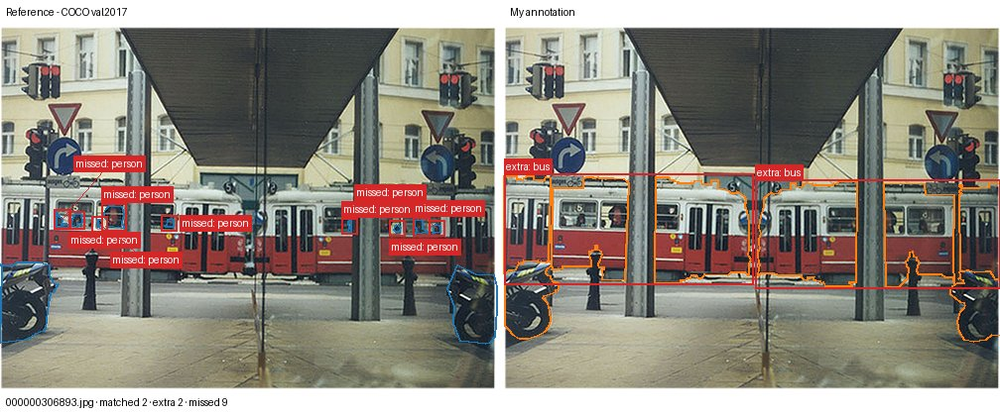

<!-- note:000000306893.jpg -->
> **Почему размечено так:** в трамвае слаборазличимые силуэты предположительно людей, но подленно определить люди это или сиденья можно не всегда, также эти силуэты выглядят как просто темные пятна и слабо напоминают людей. Решение - не размечать эти силуэты. Bus размечены согласно GUIDELINES пункт 3.
<!-- /note -->

### 000000070774.jpg

сопоставлено 3 · пропущено 1 (bicycle, 3725–3725 px²) · лишних 1 (bicycle) · слабых пар 3 (IoU 0.53–0.78)

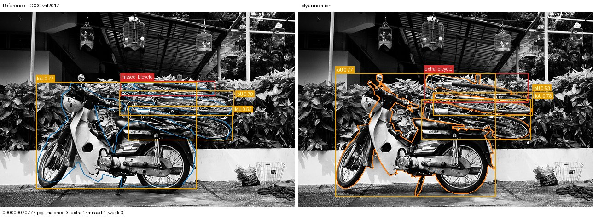

<!-- note:000000070774.jpg -->
> **Почему размечено так:** _заполнить_
<!-- /note -->

### 000000081394.jpg

сопоставлено 4 · пропущено 2 (car, motorcycle, 491–540 px²) · слабых пар 2 (IoU 0.70–0.76)

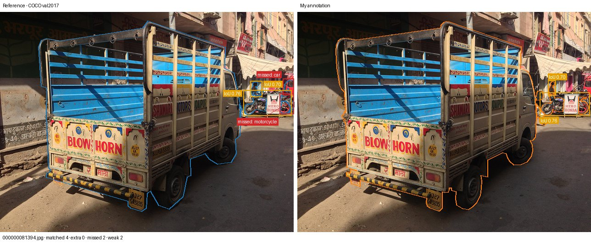

<!-- note:000000081394.jpg -->
> **Почему размечено так:** Пропущенный мотоцикл не читается визуально. Машина не размечена согласно GUIDELINES пункт 4.
<!-- /note -->

### 000000245173.jpg

сопоставлено 1 · пропущено 1 (bicycle, 921–921 px²) · лишних 2 (bicycle) · слабых пар 1 (IoU 0.69–0.69)

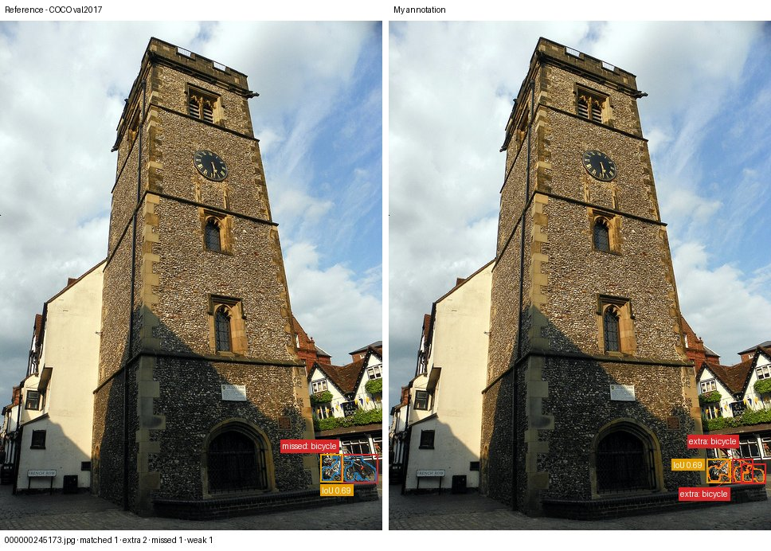

<!-- note:000000245173.jpg -->
> **Почему размечено так:** Очень спорный кадр, много визуального шума, месиво из пикселей. Размечено основываясь на читаемые человеком формы.
<!-- /note -->

### 000000251140.jpg

сопоставлено 2 · пропущено 2 (bicycle, person, 2695–3699 px²) · лишних 1 (person) · слабых пар 1 (IoU 0.70–0.70)

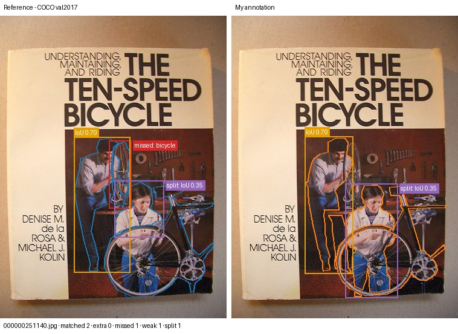

<!-- note:000000251140.jpg -->
> **Почему размечено так:** Велосипед на эталоне велосипедом полноценно не является. Экстра человек на кадре это ошибка оценочного скрипта, на самом деле человек один (в проблемном месте)
<!-- /note -->

### 000000292456.jpg

сопоставлено 2 · пропущено 2 (person, 2139–5699 px²) · лишних 2 (person)

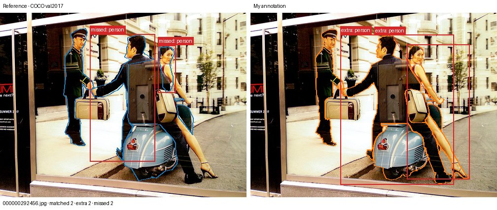

<!-- note:000000292456.jpg -->
> **Почему размечено так:** Ошибки в оценочном скрипте. Также объект квадратной формы который будто на спине человека на кадре предположительно я вляется отражением в витрине, поэтому не вырезалось из полигона.
<!-- /note -->

### 000000007386.jpg

сопоставлено 1 · пропущено 3 (bicycle, truck, 1641–5242 px²)

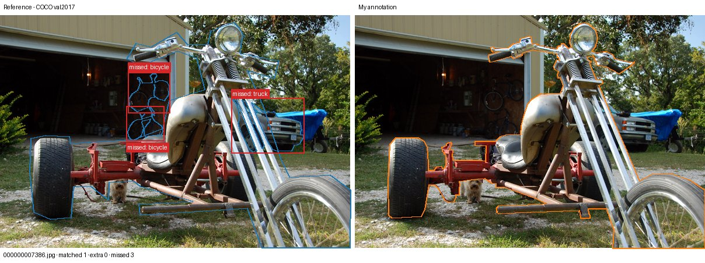

<!-- note:000000007386.jpg -->
> **Почему размечено так:** Человеческая ошибка.
<!-- /note -->

### 000000256941.jpg

сопоставлено 1 · пропущено 1 (bicycle, 9508–9508 px²) · лишних 1 (bicycle) · слабых пар 1 (IoU 0.66–0.66)

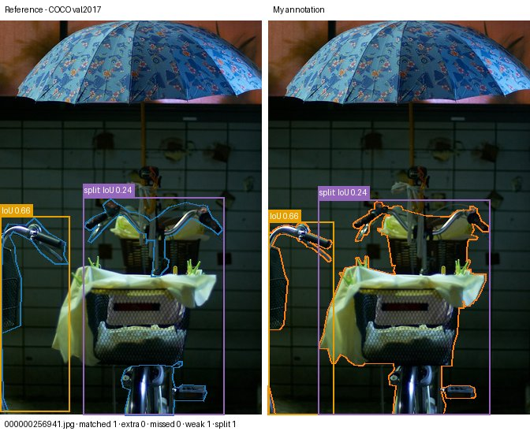

<!-- note:000000256941.jpg -->
> **Почему размечено так:** Ошибка скрипта. Корзинки на велосипеде читаются как его часть, для человека.
<!-- /note -->

### 000000013177.jpg

сопоставлено 2 · пропущено 1 (bicycle, 13846–13846 px²) · лишних 1 (motorcycle)

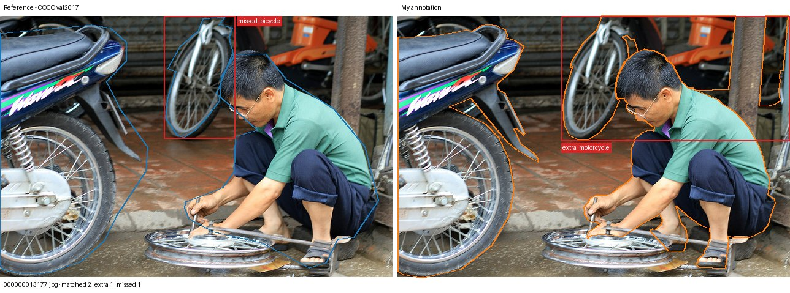

<!-- note:000000013177.jpg -->
> **Почему размечено так:** Определение класса это ошибка человека. Полигон во втором случае более правильный.
<!-- /note -->

### 000000226903.jpg

сопоставлено 2 · лишних 1 (bicycle) · слабых пар 1 (IoU 0.80–0.80)

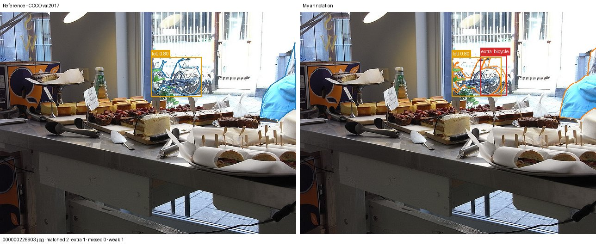

<!-- note:000000226903.jpg -->
> **Почему размечено так:** На картинке отчетливо два велосипеда. Границы плохо читаются, но велосипеда точно два.
<!-- /note -->

### 000000273551.jpg

сопоставлено 3 · лишних 1 (motorcycle) · слабых пар 1 (IoU 0.72–0.72)

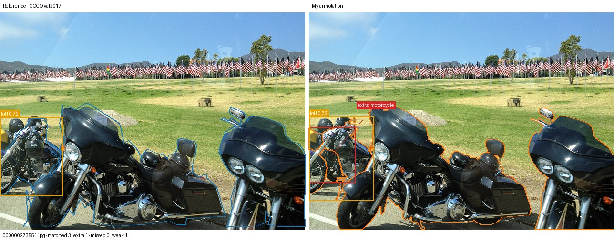

<!-- note:000000273551.jpg -->
> **Почему размечено так:** На фоне одного из мотоциклов виднеется еще один, и его части можно разметить ведь они достаточно отчетливо читаются.
<!-- /note -->

### 000000355817.jpg

сопоставлено 2 · пропущено 1 (person, 542–542 px²) · слабых пар 1 (IoU 0.68–0.68)

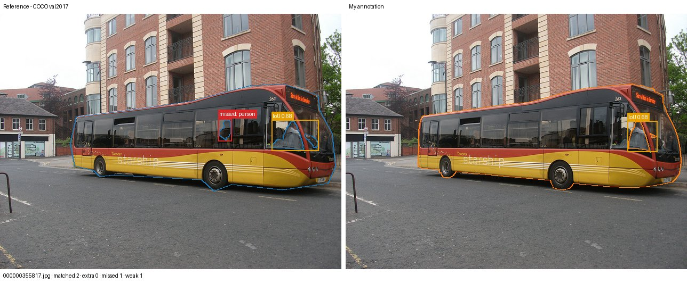

<!-- note:000000355817.jpg -->
> **Почему размечено так:** Человек читается неоднозначно, поэтому было принято решение его не размечать.
<!-- /note -->

### 000000458223.jpg

сопоставлено 1 · пропущено 1 (bicycle, 997–997 px²) · лишних 1 (bicycle)

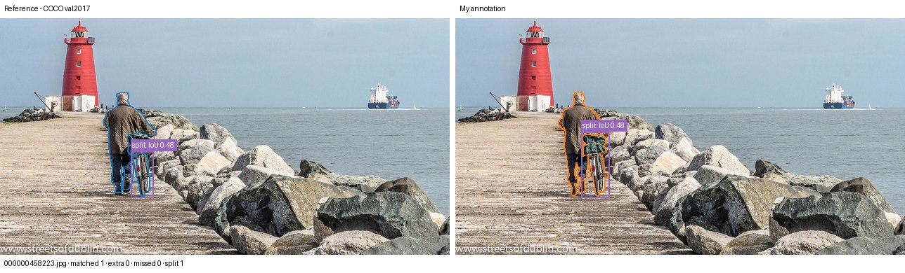

<!-- note:000000458223.jpg -->
> **Почему размечено так:** Ошибка скрипта, все размечено корректно.
<!-- /note -->

### 000000192699.jpg

сопоставлено 4 · слабых пар 1 (IoU 0.77–0.77)

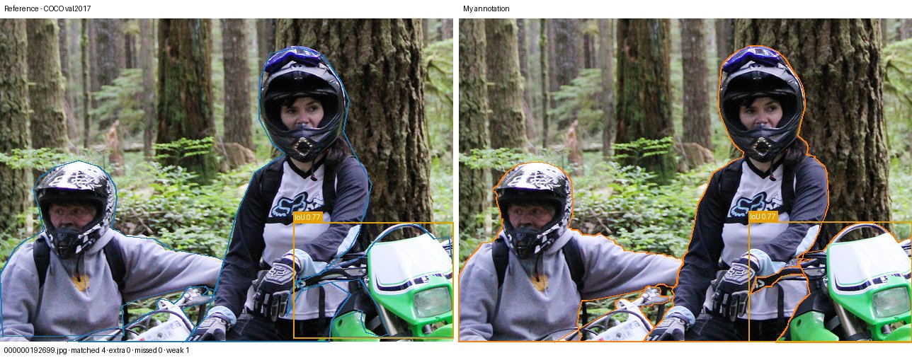

<!-- note:000000192699.jpg -->
> **Почему размечено так:** _заполнить_
<!-- /note -->

### 000000341469.jpg

сопоставлено 3 · слабых пар 1 (IoU 0.65–0.65)

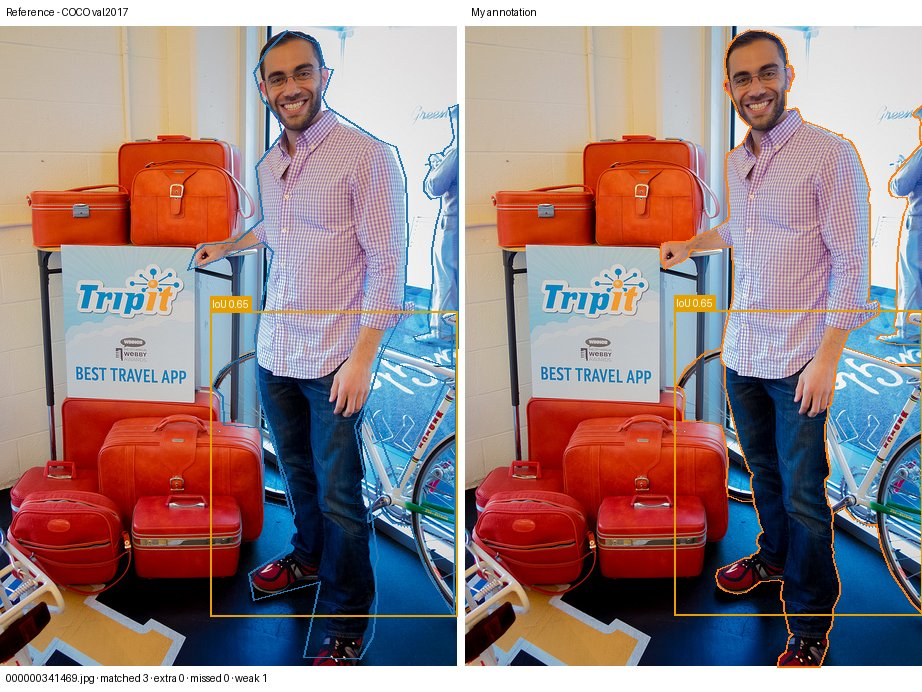

<!-- note:000000341469.jpg -->
> **Почему размечено так:** _заполнить_
<!-- /note -->

### 000000473118.jpg

сопоставлено 2 · слабых пар 1 (IoU 0.74–0.74)

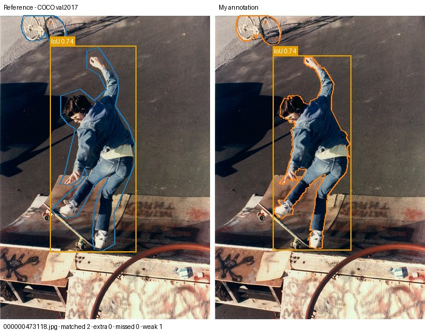

<!-- note:000000473118.jpg -->
> **Почему размечено так:** Малый IoU из-за разной точности разметки (точность не была указана в GUIDELINES)
<!-- /note -->

### 000000513580.jpg

сопоставлено 2 · слабых пар 1 (IoU 0.75–0.75)

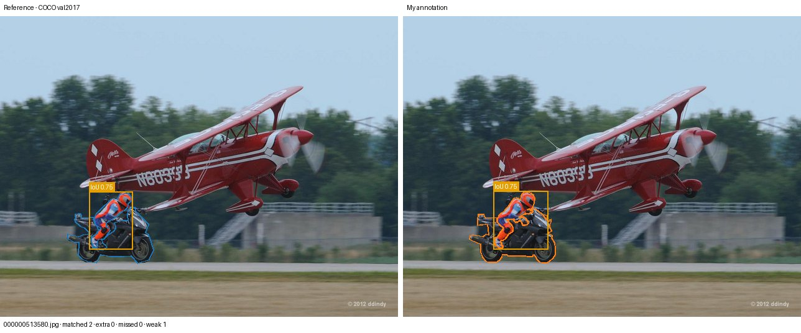

<!-- note:000000513580.jpg -->
> **Почему размечено так:** _заполнить_
<!-- /note -->

### 000000551794.jpg

сопоставлено 2 · слабых пар 1 (IoU 0.69–0.69)

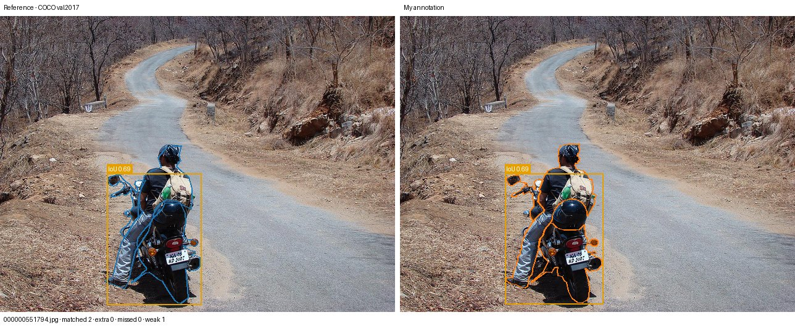

<!-- note:000000551794.jpg -->
> **Почему размечено так:** Мотоциклетный шлем явно читается как отдельный от мотоцикла объект в данном случае.
<!-- /note -->

### 000000578792.jpg

сопоставлено 2 · слабых пар 1 (IoU 0.73–0.73)

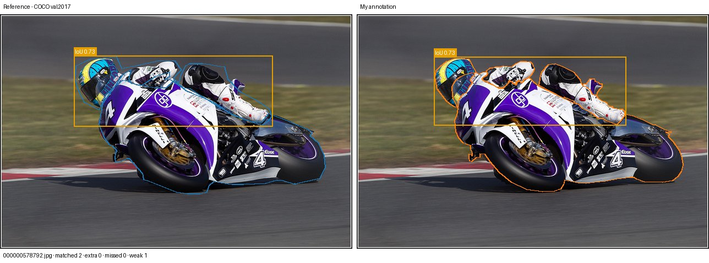

<!-- note:000000578792.jpg -->
> **Почему размечено так:** _заполнить_
<!-- /note -->

### Без расхождений

Ещё 6 кадров сошлись с эталоном полностью: ни пропусков, ни лишних объектов, все пары выше mask IoU 0.8.

### 000000010363.jpg

сопоставлено 2 · расхождений нет

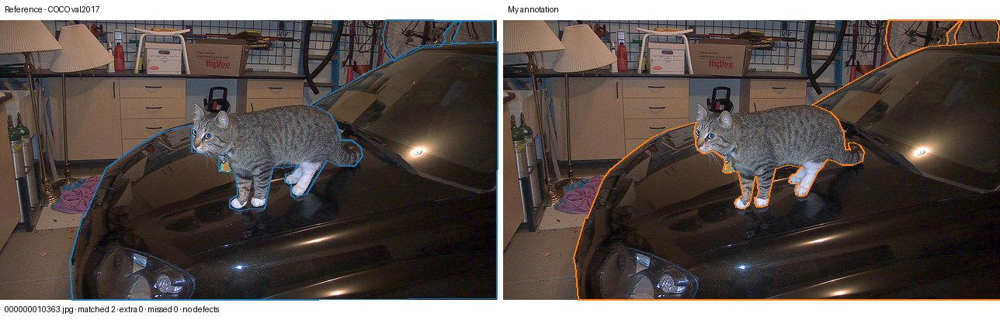

<!-- note:000000010363.jpg -->
> **Почему размечено так:** _заполнить_
<!-- /note -->

### 000000102356.jpg

сопоставлено 2 · расхождений нет

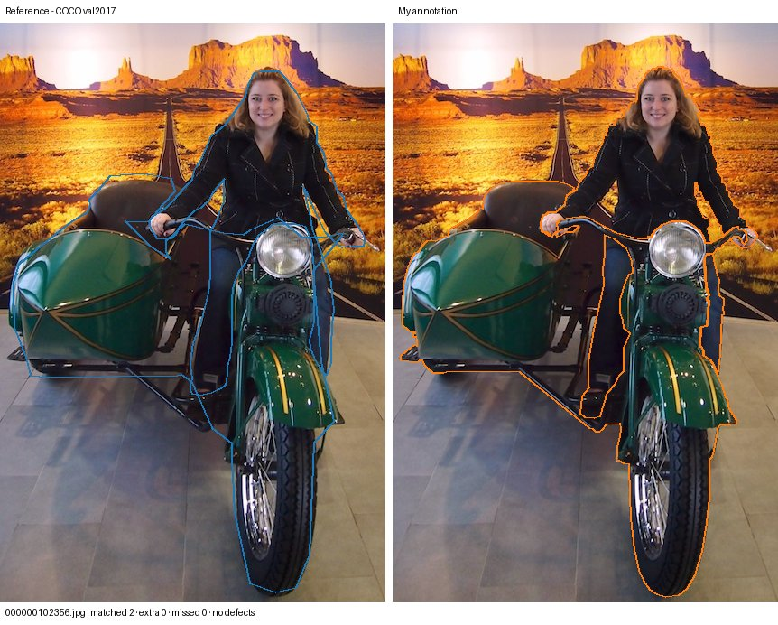

<!-- note:000000102356.jpg -->
> **Почему размечено так:** _заполнить_
<!-- /note -->

### 000000152120.jpg

сопоставлено 2 · расхождений нет

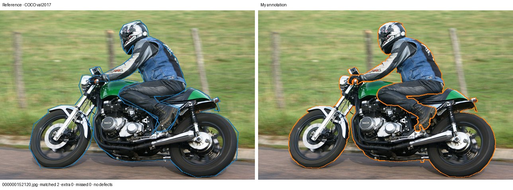

<!-- note:000000152120.jpg -->
> **Почему размечено так:** _заполнить_
<!-- /note -->

### 000000472623.jpg

сопоставлено 4 · расхождений нет

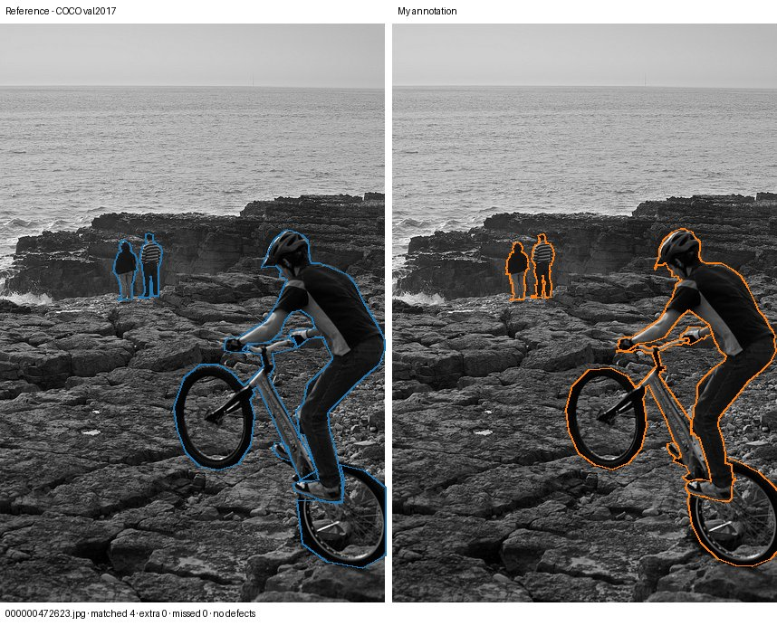

<!-- note:000000472623.jpg -->
> **Почему размечено так:** _заполнить_
<!-- /note -->

### 000000492937.jpg

сопоставлено 2 · расхождений нет

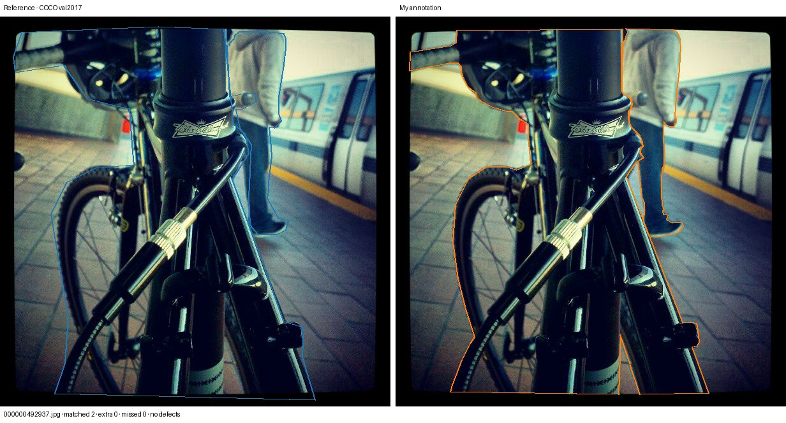

<!-- note:000000492937.jpg -->
> **Почему размечено так:** _заполнить_
<!-- /note -->

### 000000546976.jpg

сопоставлено 2 · расхождений нет

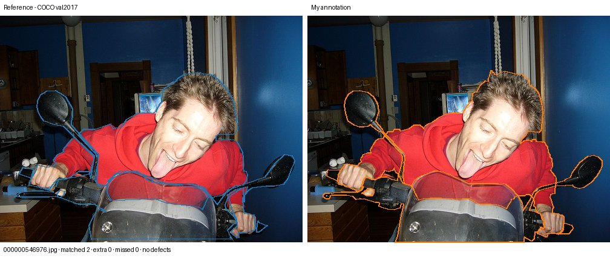

<!-- note:000000546976.jpg -->
> **Почему размечено так:** _заполнить_
<!-- /note -->

## Правила, которые из этого выросли

Разбор кадров дал два правила, дописанных в
[`annotation/GUIDELINES.md`](annotation/GUIDELINES.md), раздел 2:

- **2.1** мелкие объекты заднего плана размечаются, кадр проходится дважды — чинится
  переразметкой, а не смягчением порога;
- **2.2** детализация контура задаётся инструкцией, а не стремлением к точности —
  чинится инструкцией, сданная работа задним числом не бракуется.

Каждое правило записано с кадром-примером, числом и датой. История правил — такой же
артефакт, как метрики: по ней видно, откуда взялось решение.

## Полигон против бокса

Те же кадры размечены боксами в
[detection-annotation-quality](https://github.com/daviddolya/detection-annotation-quality)
(100 кадров, Cohen's kappa 0.914, средний IoU 0.867). На пересечении двух проектов
видно то, чего не видно ни в одном по отдельности: полигон занимает около 60% площади
своего бокса, то есть **40% боксовой разметки — фон**. По классам цена разная:
у `bus` 78% и 18 вершин, у `motorcycle` 53% и 37 вершин. Полигоны окупаются не везде,
и решение по классам принимается числом.

## Воспроизведение

Данные под git не хранятся, кроме отобранных 25 кадров. Полный набор COCO val2017 —
[изображения](http://images.cocodataset.org/zips/val2017.zip),
[аннотации](http://images.cocodataset.org/annotations/annotations_trainval2017.zip).

```bash
python3 -m venv .venv && .venv/bin/pip install -q pillow numpy
REF=../detection-annotation-quality/data/coco/annotation/instances_val2017.json

.venv/bin/python annotation/polygon_agreement.py \
    --mine annotation/my_labels/instances_default.json \
    --reference $REF --out reports/polygon_metrics.json

.venv/bin/python tools/render_pairs.py \
    --mine annotation/my_labels/instances_default.json --reference $REF \
    --images data/subset/frames --out reports/pairs \
    --manifest reports/pairs_manifest.json

.venv/bin/python tools/build_readme.py
```

Последняя команда пересобирает этот файл. Комментарии под кадрами при пересборке
сохраняются — они лежат между маркерами `<!-- note:кадр -->` и `<!-- /note -->`.

## Состав

```
annotation/
├── GUIDELINES.md          инструкция: правила контура и решения по спорным случаям
├── my_labels/             своя разметка, экспорт CVAT в COCO 1.0
└── polygon_agreement.py   сопоставление объектов и метрики согласия
common/
├── polygons.py            растеризация, mask IoU, Dice, Boundary IoU
├── boxes.py, agreement.py перенесены из проекта по боксам
tools/
├── select_polygon_frames.py  отбор 25 кадров под полигоны
├── polygon_stats.py          полигон против бокса на эталоне
├── miss_breakdown.py         пропуск: не размечен или контур разошёлся
├── render_polygons.py        совмещённый кадр и вырезки для работы глазами
├── render_pairs.py           парные картинки для этого README
└── build_readme.py           сборка README
reports/
├── polygon_metrics.json   числа
├── pairs/                 парные картинки, 25 штук
└── review/                совмещённые кадры и вырезки
DEBT.md                    что написано ассистентом и что нужно уметь объяснить
```
